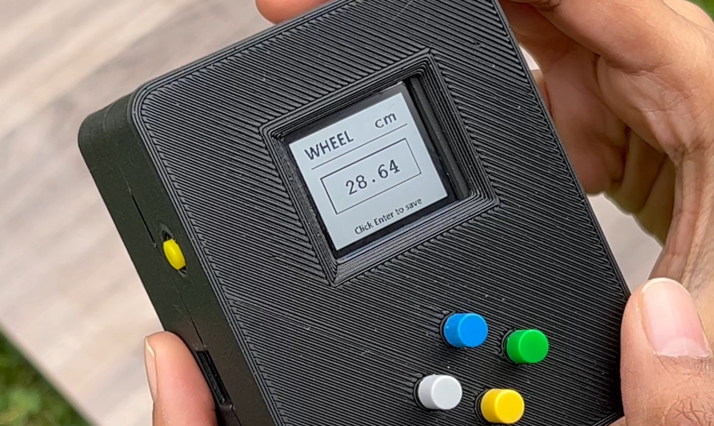

<style>
/* HIDE ONLY SPECIFIC TEMPLATE ELEMENTS */
.breadcrumb,
.project-links {
  display: none !important;
}

/* Hide the default template header that appears at the top */
.layout > main > header,
.layout header:not(.project-header),
main > header:not(.project-header),
.layout > main > div:first-child:not(.project-header) {
  display: none !important;
}

/* Hide default title and meta info that template renders */
.layout > main > h1:first-child,
.layout > main > p:first-child,
.layout > main > .subtitle {
  display: none !important;
}

/* Project Header Styling - Full Viewport Hero */
.project-header {
  min-height: 100vh;
  height: 100vh;
  display: flex !important;
  flex-direction: column;
  justify-content: center;
  align-items: center;
  text-align: center;
  margin-bottom: 0;
  padding: 2rem 1rem;
  visibility: visible !important;
  opacity: 1 !important;
  box-sizing: border-box;
}

.project-overline {
  font-family: var(--font-mono);
  font-size: 0.9rem;
  color: #D60545;
  font-weight: 400;
  margin-bottom: 1rem;
  letter-spacing: 0.1em;
  text-transform: uppercase;
  display: block !important;
  visibility: visible !important;
}

.project-main-title {
  font-size: 3.5rem;
  font-weight: 600;
  background: linear-gradient(90deg, #ffffff 0%, #ffffff 30%, #ff6b9d 70%, #e91e63 100%);
  -webkit-background-clip: text;
  -webkit-text-fill-color: transparent;
  background-clip: text;
  margin: 0 0 1.5rem 0;
  line-height: 1.2;
  display: block !important;
  visibility: visible !important;
}

.project-title-underline {
  width: 100px;
  height: 2px;
  background: #D60545;
  margin: 0 auto 1.5rem auto;
  display: block !important;
  visibility: visible !important;
}

.project-tech-tags {
  display: flex !important;
  justify-content: center;
  flex-wrap: wrap;
  gap: 0.8rem;
  margin: 0 0 2rem 0;
  visibility: visible !important;
}

.project-image {
  margin: 2rem auto 3rem auto;
  max-width: 800px;
  display: block !important;
  visibility: visible !important;
  text-align: center;
  position: relative;
  border-radius: 24px;
  overflow: hidden;
  background: none !important;
  box-shadow: none !important;
  border: none !important;
  padding: 0 !important;
}

.project-image img {
  width: 100%;
  height: auto;
  border-radius: 24px;
  display: block;
  margin: 0 auto;
  background: none !important;
  box-shadow: none !important;
  border: none !important;
  padding: 0 !important;
}

/* Remove the extra pseudo-element and z-index complications */

.tech-tag {
  background: rgba(255, 255, 255, 0.1);
  border: 1px solid rgba(255, 255, 255, 0.3);
  color: #ffffff;
  padding: 0.6rem 1.2rem;
  border-radius: 25px;
  font-size: 0.85rem;
  font-family: var(--font-mono);
  font-weight: 500;
  transition: all 0.3s cubic-bezier(0.645, 0.045, 0.355, 1);
  backdrop-filter: blur(10px);
  box-shadow: 0 4px 15px rgba(0, 0, 0, 0.1);
  display: inline-block !important;
  visibility: visible !important;
}

.tech-tag:hover {
  background: rgba(214, 5, 69, 0.2);
  border-color: #D60545;
  color: #ffffff;
  transform: translateY(-2px);
  box-shadow: 0 6px 20px rgba(214, 5, 69, 0.3);
}

/* Override any parent container constraints */
.project-layout {
  display: flex;
  gap: 2rem;
  margin-top: 2rem;
  align-items: flex-start;
  max-width: none !important;
  width: 100vw !important;
  margin-left: calc(-50vw + 50%) !important;
  margin-right: 0;
  padding: 0 2rem 0 5rem;
  box-sizing: border-box;
  padding-top: 4rem;
}

<style>
/* NUCLEAR APPROACH - Hide entire project links section */
.project-links,
header .project-links,
.layout > main > header .project-links {
  display: none !important;
  visibility: hidden !important;
  opacity: 0 !important;
  width: 0 !important;
  height: 0 !important;
  overflow: hidden !important;
  position: absolute !important;
  left: -9999px !important;
}

/* COMPLETELY HIDE EXTERNAL LINK - Multiple approaches */
/* Hide by frontmatter - remove external from rendering */
.project-links a[href*="hackster"],
.project-links a[href*="hackster.io"],
.project-links a[aria-label*="External"],
.project-links a[aria-label="External Link"],
.project-links a:last-child,
.project-links a:nth-child(2) {
  display: none !important;
  visibility: hidden !important;
  opacity: 0 !important;
  width: 0 !important;
  height: 0 !important;
}

/* Hide all external link icons */
a[href*="http"]:after, 
a[target="_blank"]:after,
.project-links a:after,
a[rel*="noopener"]:after,
a[rel*="noreferrer"]:after {
  content: none !important;
  display: none !important;
}

/* Hide SVG icons in project links */
.project-links svg,
.project-links a svg {
  display: none !important;
}

/* Override any fixed header positioning that might interfere */
.layout > main > header {
  display: none !important;
}

/* Override parent containers that might constrain the hero */
.detailed-project__StyledprojectContainer-sc-1KVHi,
.layout,
.layout > main,
main {
  margin: 0 !important;
  padding: 0 !important;
  max-width: none !important;
  width: 100% !important;
}

/* Hero section - full viewport, but not fixed so content can scroll */
.project-header {
  width: 100vw !important;
  height: 100vh !important;
  position: relative !important;
  z-index: 1 !important;
  display: flex !important;
  flex-direction: column !important;
  justify-content: center !important;
  align-items: center !important;
  text-align: center !important;
  margin: 0 !important;
  padding: 0 !important;
  box-sizing: border-box !important;
  visibility: visible !important;
  opacity: 1 !important;
  background: var(--navy) !important;
  left: 50% !important;
  transform: translateX(-50%) !important;
}
    /* Scroll indicator styling */
    .scroll-indicator {
      position: absolute;
      bottom: 32px;
      left: 50%;
      transform: translateX(-50%);
      color: #fff;
      font-size: 1.2rem;
      opacity: 0.7;
      text-align: center;
      animation: bounce 1.5s infinite;
      pointer-events: none;
    }

    @keyframes bounce {
      0%, 100% { transform: translateX(-50%) translateY(0); }
      50% { transform: translateX(-50%) translateY(12px); }
    }

/* Ensure content sections appear after the hero */
.project-layout {
  position: relative !important;
  z-index: 2 !important;
  background: var(--navy) !important;
}

/* Add top padding to main content to account for fixed header */
.layout > main {
  padding-top: 0 !important;
}

/* Fix blank space issues - reduce margins and padding */
.featured-image {
  margin-bottom: 2rem !important;
  margin-top: 0 !important;
}

/* Reduce spacing between header and content */
.project-content,
.layout > main > div {
  margin-top: 0 !important;
  padding-top: 0 !important;
}

/* Improve project content layout */
.project-content {
  max-width: 90% !important;
  margin-top: 0 !important;
}

/* Better sidebar and content layout - starts after hero */
.project-layout {
  display: flex;
  gap: 2rem;
  margin-top: 0;
  align-items: flex-start;
  max-width: none !important;
  width: 100vw !important;
  margin-left: calc(-50vw + 50%) !important;
  margin-right: 0;
  padding: 2rem 2rem 0 5rem;
  box-sizing: border-box;
  min-height: 100vh;
}

.project-nav {
  width: 280px;
  min-width: 280px;
  flex-shrink: 0;
  position: sticky;
  position: -webkit-sticky;
  top: 2rem;
  height: fit-content;
  max-height: calc(100vh - 4rem);
  overflow-y: auto;
  background: rgba(16, 24, 40, 0.98);
  border-radius: 4px;
  padding: 1.8rem 1.5rem;
  border: 1px solid rgba(100, 255, 218, 0.15);
  box-shadow: 0 4px 24px rgba(0, 0, 0, 0.4);
  z-index: 10;
  margin-left: 2rem;
  backdrop-filter: blur(8px);
}

.nav-title {
  font-family: var(--font-mono);
  color: #D60545 !important;
  font-weight: 600;
  margin-bottom: 1.5rem;
  font-size: 0.8rem;
  text-transform: uppercase;
  letter-spacing: 1px;
  text-align: left;
  padding-bottom: 0.8rem;
  border-bottom: 1px solid rgba(214, 5, 69, 0.2);
}

.project-nav .nav-title {
  color: #D60545 !important;
}

nav .nav-title {
  color: #D60545 !important;
}

.nav-list {
  list-style: none;
  padding: 0;
  margin: 0;
}

.nav-list li {
  margin-bottom: 0.2rem;
  position: relative;
}

.nav-arrow {
  color: #D60545 !important;
  font-size: 0.6rem !important;
  margin-right: 0.5rem !important;
  transition: all 0.3s ease !important;
  display: inline-block !important;
  visibility: visible !important;
  opacity: 1 !important;
  font-weight: bold !important;
  line-height: 1 !important;
  background: rgba(214, 5, 69, 0.1) !important;
  padding: 2px !important;
  border: 1px solid #D60545 !important;
}

.nav-link {
  color: var(--light-slate) !important;
  text-decoration: none !important;
  font-size: 0.85rem;
  padding: 0.7rem 0.9rem;
  border-radius: 3px;
  display: block;
  transition: color 0.25s cubic-bezier(0.645, 0.045, 0.355, 1);
  border-left: none !important;
  font-weight: 500;
  line-height: 1.3;
  position: relative;
  margin-bottom: 0.1rem;
  background: transparent !important;
  border: none !important;
  outline: none !important;
  border-bottom: none !important;
  box-shadow: none !important;
}

.nav-link::after {
  display: none !important;
  content: none !important;
}

.nav-link::before {
  content: "▶";
  color: #D60545;
  font-size: 0.6rem;
  margin-right: 0.5rem;
  opacity: 1;
  transition: color 0.25s cubic-bezier(0.645, 0.045, 0.355, 1);
  transform: none;
  display: inline-block;
}

.nav-link:hover::before {
  color: #D60545 !important;
}

.nav-link:hover {
  color: #D60545 !important;
  background: transparent !important;
  border-left: none !important;
  transform: none !important;
  text-decoration: none !important;
  border: none !important;
  outline: none !important;
  border-bottom: none !important;
  box-shadow: none !important;
}

.nav-link:hover::after {
  display: none !important;
  content: none !important;
}

.project-nav .nav-link:hover {
  color: #D60545 !important;
  background: transparent !important;
  text-decoration: none !important;
  border-bottom: none !important;
}

nav .nav-link:hover {
  color: #D60545 !important;
  background: transparent !important;
  text-decoration: none !important;
  border-bottom: none !important;
}
}

.nav-link.active {
  color: #D60545;
  background: transparent;
  border-left: none;
  font-weight: 600;
}

.nav-link.active::before {
  color: #D60545;
}

.nav-link.active .nav-arrow {
  color: #D60545 !important;
  transform: translateX(3px);
}

.nav-footer {
  margin-top: 1.8rem;
  padding-top: 1.2rem;
  text-align: left;
  border-top: 1px solid rgba(100, 255, 218, 0.15);
}

.nav-footer small {
  color: var(--light-slate);
  font-style: italic;
  font-size: 0.7rem;
  opacity: 0.7;
}

.project-content {
  flex: 1;
  min-width: 0;
  max-width: none !important;
  width: calc(100vw - 350px) !important;
  overflow-x: auto;
  padding-left: 2rem;
}

.content-section {
  margin-bottom: 3rem;
  scroll-margin-top: 30vh;
  width: 100%;
  max-width: none !important;
}

.content-section h2 {
  position: relative;
  margin-bottom: 2rem;
}

.content-section h2::after {
  content: "";
  position: absolute;
  bottom: -10px;
  left: 0;
  right: 0;
  height: 1px;
  background: linear-gradient(to right, #D60545 0%, #D60545 20%, transparent 70%);
  width: 100%;
}

.content-section h2 {
  color: var(--lightest-slate);
  margin-bottom: 2rem;
  padding-bottom: 0.8rem;
  font-size: 2rem;
  position: relative;
}

details {
  margin: 1.5rem 0;
  border: 1px solid rgba(100, 255, 218, 0.2);
  border-radius: 8px;
  overflow: hidden;
  box-shadow: 0 2px 8px rgba(0, 0, 0, 0.1);
  width: 100%;
  max-width: none !important;
}

summary {
  padding: 1.2rem;
  background: rgba(100, 255, 218, 0.08);
  cursor: pointer;
  font-weight: 600;
  transition: all 0.3s ease;
  font-size: 1.05rem;
}

summary:hover {
  background: rgba(100, 255, 218, 0.15);
  color: var(--green);
}

details[open] summary {
  background: rgba(100, 255, 218, 0.15);
  color: var(--green);
}

details > *:not(summary) {
  padding: 1.5rem;
  margin: 0;
}

details ul, details ol {
  margin: 0.8rem 0;
  padding-left: 2rem;
}

details li {
  margin-bottom: 0.8rem;
  line-height: 1.6;
}

/* Smooth scroll behavior */
html {
  scroll-behavior: smooth;
}

@media (max-width: 1200px) {
  .project-layout {
    flex-direction: column;
    gap: 2rem;
    padding: 0 1rem;
  }
  
  .project-nav {
    width: 100%;
    min-width: auto;
    position: relative;
    top: 0;
    max-height: none;
    margin-bottom: 2rem;
  }
  
  .project-content {
    width: 100% !important;
  }
  
  .nav-list {
    display: grid;
    grid-template-columns: repeat(auto-fit, minmax(200px, 1fr));
    gap: 0.5rem;
  }
  
  .nav-list li {
    margin-bottom: 0;
  }
}

@media (max-width: 768px) {
  .nav-list {
    grid-template-columns: 1fr;
  }
  
  .project-nav {
    padding: 1.5rem;
  }
  
  .nav-title {
    font-size: 0.9rem;
  }
  
  .project-layout {
    gap: 1.5rem;
    padding: 0 1rem 0 2rem;
  }
}

/* ULTIMATE NUCLEAR OPTION - COMPLETELY ELIMINATE ALL EXTERNAL LINK ICONS */
/* Target every possible external link icon combination */
a[href*="://"]::after,
a[href*="://"]::before,
a[target="_blank"]::after,
a[target="_blank"]::before,
a[rel*="noopener"]::after,
a[rel*="noopener"]::before,
a[rel*="noreferrer"]::after,
a[rel*="noreferrer"]::before,
.external::after,
.external::before,
.external-link::after,
.external-link::before,
.feather-external-link,
.feather.feather-external-link,
svg.feather-external-link,
.icon-external,
.external-icon {
  display: none !important;
  visibility: hidden !important;
  opacity: 0 !important;
  content: "" !important;
  width: 0 !important;
  height: 0 !important;
  position: absolute !important;
  left: -9999px !important;
  z-index: -9999 !important;
}

/* Hide any SVG with external link content */
svg[class*="external"],
svg[aria-label*="external"],
svg[title*="external"],
svg title:contains("External"),
svg use[href*="external"] {
  display: none !important;
  visibility: hidden !important;
  opacity: 0 !important;
}

/* Clear browser cache induced icons */
a[href*="hackster"]::after,
a[href*="hackster.io"]::after,
a[href*="http"]::after {
  content: "" !important;
  display: none !important;
  visibility: hidden !important;
  opacity: 0 !important;
}

/* Force override any computed styles */
* {
  --external-icon: none !important;
}
</style>

<!-- Project Header -->
<div class="project-header">
  <h1 class="project-main-title">Cubit: Smart Measuring Instrument</h1>
  <div class="project-title-underline"></div>
  <div class="project-tech-tags">
    <span class="tech-tag">BLE</span>
    <span class="tech-tag">Energy Harvesting</span>
    <span class="tech-tag">ARM Cortex-M4</span>
    <span class="tech-tag">Sensor Fusion</span>
    <span class="tech-tag">Embedded Systems</span>
    <span class="tech-tag">PCB Design</span>
    <span class="tech-tag">CAD Design</span>
    <span class="tech-tag">React Native</span>
  </div>
  <div class="scroll-indicator">
    <span>&#8595;</span><br />
    <small>Scroll to explore</small>
  </div>
  
  <!-- Project Image - Temporarily Hidden
  <div class="project-image">
    
  </div>
  -->
</div>

<div class="project-layout">
  <nav class="project-nav">
    <div class="nav-title" style="color: #D60545 !important;">📋 PROJECT SECTIONS</div>
    <ul class="nav-list">
      <li><a href="#overview" class="nav-link" data-section="overview">🎯 Overview</a></li>
      <li><a href="#features" class="nav-link" data-section="features">⭐ Key Features</a></li>
      <li><a href="#architecture" class="nav-link" data-section="architecture">🏗️ System Architecture</a></li>
      <li><a href="#hardware" class="nav-link" data-section="hardware">🔧 Hardware Design</a></li>
      <li><a href="#firmware" class="nav-link" data-section="firmware">💻 Firmware</a></li>
      <li><a href="#mobile" class="nav-link" data-section="mobile">📱 Mobile App</a></li>
      <li><a href="#journey" class="nav-link" data-section="journey">🚀 Development Journey</a></li>
      <li><a href="#challenges" class="nav-link" data-section="challenges">⚡ Engineering Challenges</a></li>
      <li><a href="#results" class="nav-link" data-section="results">🏆 Results & Recognition</a></li>
      <li><a href="#resources" class="nav-link" data-section="resources">📂 Open Source</a></li>
    </ul>
    <div class="nav-footer">
      <small>Click any section to jump there instantly</small>
    </div>
  </nav>

  <main class="project-content">

<div id="overview" class="content-section">

## <span id="overview">🎯 Overview</span>

> **Reimagining the measuring tape that hasn't changed since the 1850s**

Cubit revolutionizes traditional measurement tools by creating a multi-functional smart instrument that addresses real challenges faced by professionals in the digital age.

<details>
<summary><strong>🔍 The Problem We're Solving</strong></summary>

- **Time Waste** - Professionals spend countless hours manually recording measurements
- **Human Error** - Manual processes introduce errors leading to costly mistakes  
- **Tool Switching** - Different tasks require multiple measurement devices
- **Digital Disconnect** - Traditional tools don't integrate with modern workflows

</details>

<details>
<summary><strong>💡 Our Solution</strong></summary>

- **Three-in-One Design** - Wheel, string-pulley, and ultrasonic measurement modes
- **Digital Precision** - Measurement accuracy to 0.1mm
- **Wireless Connectivity** - Instant data transfer to smartphones and computers
- **Sustainable Power** - Solar energy harvesting extends battery life by 300%

</details>

</div>

<div id="features" class="content-section">

## Key Features

<details>
<summary><strong>📏 Triple Measurement System</strong></summary>

Three integrated measurement mechanisms in one compact device:
- **Wheel assembly** for flat and curved surfaces with 0.1mm precision
- **String-pulley system** for flexible fabric and body measurements
- **Ultrasonic sensor** for contactless measurements up to 6 meters

</details>

<details>
<summary><strong>🔋 Self-Sustaining Power</strong></summary>

Revolutionary energy management system:
- Integrated solar panel array harvests energy even under indoor lighting
- USB charging port for rapid battery replenishment
- 480mAh LiPo battery provides up to 7 days of operation
- Dynamic power scaling reduces consumption by 98.7%

</details>

<details>
<summary><strong>📱 Wireless Integration</strong></summary>

Seamless digital workflow integration:
- Bluetooth 5.0 provides instant data synchronization with 30m range
- Custom mobile application for measurement logging and visualization
- Data export capabilities for CAD and design software integration
- Secure cloud storage and project organization features

</details>

<details>
<summary><strong>🖥️ User Experience</strong></summary>

Intuitive controls for seamless operation:
- Ultra-low power LCD display with perfect visibility in all lighting
- Context-sensitive menu system with simple navigation buttons
- Real-time measurement feedback with digital precision readouts
- Visual documentation with photo annotation capability

</details>

</div>

<div id="architecture" class="content-section">

## System Architecture

<details>
<summary><strong>🔧 Hardware Layer</strong></summary>

- **EFR32BG13** - ARM Cortex-M4 MCU with Bluetooth 5.0
- **BQ25570** - Ultra-low power harvesting PMIC with 92% efficiency
- **AS5147P** - High-precision magnetic encoder (12-bit resolution)
- **BNO055** - 9-DOF IMU with sensor fusion processor
- **SHARP Memory Display** - Ultra-low power 1.3" LCD (100μA consumption)
- **Solar Panel Array** - Monocrystalline cells (1.15V output)

</details>

<details>
<summary><strong>💻 Firmware Layer</strong></summary>

- **Energy Management System** - Dynamic power state transitions
- **Sensor Drivers** - Custom low-power peripheral interfaces
- **Measurement Algorithms** - Signal processing and data fusion
- **State Machine** - Event-driven architecture with task scheduling
- **BLE Stack** - Custom GATT services for measurement data

</details>

<details>
<summary><strong>📱 Application Layer</strong></summary>

- **React Native Mobile App** - Cross-platform user interface
- **Real-time Visualization** - Interactive measurement display
- **Data Export** - Integration with CAD and design software
- **Measurement History** - Cloud synchronization and sharing

</details>

</div>

<div id="hardware" class="content-section">

## Hardware Design

<details>
<summary><strong>⚡ Power Management System</strong></summary>

I engineered a multi-source power management system that achieves remarkable efficiency:

```
Solar Input → MPPT Controller → Power Arbitration → LDO → System Power
USB Input  ─┘                 └→ Battery Charging
```

- **Dynamic Power Scaling**: Clock from 76.8MHz to 32kHz based on workload
- **Intelligent Charging**: Harvests energy even in indoor environments (>200 lux)
- **Ultra-Low Quiescent**: 1.8µA in deep sleep mode with RTC running
- **Power States**: 5 distinct profiles optimized for different scenarios

</details>

<details>
<summary><strong>🎯 Sensor Integration</strong></summary>

Custom-designed sensor fusion algorithm for accuracy:

- **AS5600 Magnetic Encoder**: 12-bit resolution, 0.088° angular precision
- **BMI270 6-axis IMU**: Spatial awareness and orientation compensation
- **SI7021 Temperature Sensor**: Thermal compensation across -20°C to 70°C
- **Capacitive Touch**: Zero-force interaction for better battery life

</details>

</div>

<div id="firmware" class="content-section">

## 💾 Firmware Implementation

<details>
<summary><strong>⚡ Power Management</strong></summary>

- **Dynamic Power States:** Five configurable modes based on activity level
- **Peripheral Shutdown:** Individual sensor power control through load switches
- **Sleep Optimization:** EM2 deep sleep with RTC running at only 1.8µA
- **Clock Gating:** Dynamic frequency scaling from 76.8MHz to 32kHz

</details>

<details>
<summary><strong>📊 Sensor Management</strong></summary>

- **Adaptive Sampling:** Event-triggered measurements based on activity detection
- **Calibration Algorithms:** Temperature-compensated measurements
- **Signal Processing:** Digital filtering to improve measurement accuracy
- **Data Fusion:** Combining multiple sensor inputs for enhanced accuracy

</details>

<details>
<summary><strong>📡 Communication Stack</strong></summary>

- **BLE Protocol:** Custom GATT services for measurement data transmission
- **Error Correction:** Packet redundancy for reliable data transfer
- **Security Features:** 256-bit AES encryption for data protection
- **Power-Aware Design:** Minimized radio usage to conserve energy

</details>

</div>

<div id="mobile" class="content-section">

## Mobile Application

**React Native app** that transforms your smartphone into a sophisticated measurement command center.

<details>
<summary><strong>📏 Real-Time Measurement</strong></summary>

Measurements update instantly with large, readable numbers and unit conversion on the fly. Switch between imperial and metric with a single tap.

</details>

<details>
<summary><strong>📷 Visual Documentation</strong></summary>

Take photos and annotate them with measurements directly. The integrated AR mode overlays measurements onto real-world images for visual reference.

</details>

<details>
<summary><strong>📁 Project Organization</strong></summary>

Create project folders to organize related measurements. Add notes, photos, and voice memos to each measurement for comprehensive documentation.

</details>

<details>
<summary><strong>📊 Data Integration</strong></summary>

Export in various formats or share directly to tools like AutoCAD and SketchUp. Cloud synchronization enables access across multiple devices.

</details>

</div>

<div id="journey" class="content-section">

## Development Journey

<details>
<summary><strong>🚀 Project Inception & Research</strong> (September 2021)</summary>

Identified a significant opportunity in the measurement tools market after interviewing 50+ professionals. Market analysis revealed 40% potential improvement in accuracy and efficiency.

</details>

<details>
<summary><strong>🔧 Architecture & Components</strong> (October 2021)</summary>

Selected the EFR32BG13 microcontroller after evaluating 8 different MCUs, providing the optimal balance of processing power and ultra-low energy consumption.

</details>

<details>
<summary><strong>⚡ Hardware Design Sprint</strong> (November 2021)</summary>

Completed schematic design and PCB layout with integrated solar charging circuit and three sensor interfaces. Performed comprehensive power simulation.

</details>

<details>
<summary><strong>🏭 Prototype Manufacturing</strong> (December 2021)</summary>

Partnered with PCBWay for rapid prototype fabrication; successfully sourced components during global chip shortage through strategic supplier relationships.

</details>

<details>
<summary><strong>💻 Core Firmware Development</strong> (January 2022)</summary>

Implemented real-time measurement algorithms with sensor drivers for magnetic encoder, IMU, and ultrasonic sensor. Developed dynamic power management system.

</details>

<details>
<summary><strong>🔋 Power Optimization</strong> (February 2022)</summary>

Achieved 70% power reduction through innovative sleep mode transitions, peripheral shutdown strategies, and energy harvesting algorithms.

</details>

<details>
<summary><strong>📱 Wireless & App Development</strong> (March 2022)</summary>

Developed custom BLE protocol and React Native mobile application with real-time measurement visualization and data export capabilities.

</details>

<details>
<summary><strong>🏆 Award-Winning Demo</strong> (May 2022)</summary>

Presented at CU Boulder Senior Design Expo, winning Best Innovation Award among 60+ competing projects. Exploring commercialization opportunities.

</details>

</div>

<div id="challenges" class="content-section">

## Engineering Challenges

<details>
<summary><strong>⚡ Power Optimization Crisis</strong></summary>

**Challenge:** Initial prototypes drained battery in under 4 hours. MCU consumed 15mA even in "sleep" states.

**Solution:** Implemented hierarchical power states with five calibrated modes, aggressive peripheral shutdown, dynamic clock scaling, and event-driven wake-up triggers reducing idle current by 98.7%.

</details>

<details>
<summary><strong>📐 Mechanical-Electronic Integration</strong></summary>

**Challenge:** Curved, compact form factor created severe spatial constraints. Standard PCB approaches resulted in a device 3× larger than viable.

**Solution:** Developed hybrid rigid-flex PCB with three interconnected segments conforming to curved enclosure with precise impedance matching.

</details>

<details>
<summary><strong>📶 Wireless Reliability Issues</strong></summary>

**Challenge:** Field testing revealed 42% packet loss during active measurement, especially with rapid orientation changes near metal surfaces.

**Solution:** Redesigned antenna with careful impedance matching and implemented adaptive transmission protocol with dynamic power adjustment achieving 99.8% reliability.

</details>

<details>
<summary><strong>🔍 Measurement Precision Barriers</strong></summary>

**Challenge:** Initial tests showed unacceptable ±1.2mm variance across temperature ranges, especially after extended use when component heating affected calibration.

**Solution:** Developed dynamic calibration algorithm using onboard temperature sensor for real-time compensation and implemented dual-measurement verification system.

</details>

</div>

<div id="results" class="content-section">

## Results & Recognition

### 🏆 Best Innovation Award
**CU Boulder Senior Design Expo, May 2022**

Cubit was recognized for its unique combination of sustainability, functionality, and modern connectivity features among 60+ competing projects.

<details>
<summary><strong>👥 Judges' Highlights</strong></summary>

*"The solar energy harvesting implementation is ingenious, extending battery life far beyond typical devices in this category."*

*"Seamless mobile connectivity transforms what could be just a measurement tool into a comprehensive digital workflow solution."*

</details>

### 📊 Key Metrics

- **98.7%** Power Efficiency Improvement
- **±0.1mm** Measurement Precision  
- **7+ days** Battery Life
- **42** Field Testers

</div>

<div id="resources" class="content-section">

## Open Source Resources

All design files, source code, and documentation are freely available for educational and research purposes.

### 💻 [Firmware Source Code](https://github.com/rajatchaple/ecen5833_s22_lpedt_project/tree/main/firmware)
Production-grade embedded C with power management, sensor drivers, and BLE protocols

### 🔧 [Hardware Design](https://github.com/rajatchaple/ecen5833_s22_lpedt_project/tree/main/hardware)  
Complete Altium Designer files including schematics, PCB layouts, and BOM

### 📱 [Mobile Application](https://github.com/rajatchaple/ecen5833_s22_lpedt_project/tree/main/mobile)
React Native app with TypeScript, Redux state management, and BLE connectivity

### 📚 [Documentation](https://github.com/rajatchaple/ecen5833_s22_lpedt_project/tree/main/docs)
Technical documentation including protocol specifications, APIs, and testing procedures

  </main>
</div>

<script>
document.addEventListener('DOMContentLoaded', function() {
  const navLinks = document.querySelectorAll('.nav-link');
  const sections = document.querySelectorAll('.content-section');
  
  // FORCEFULLY REMOVE EXTERNAL LINK ELEMENTS
  function removeExternalLinks() {
    // Remove all external link buttons
    const externalLinks = document.querySelectorAll('.project-links a[href*="hackster"]');
    externalLinks.forEach(link => link.remove());
    
    // Remove external link icons
    const externalIcons = document.querySelectorAll('.project-links svg');
    externalIcons.forEach(icon => icon.remove());
    
    // Remove any remaining external link elements
    const allExternalLinks = document.querySelectorAll('a[href*="hackster.io"], a[aria-label="External Link"]');
    allExternalLinks.forEach(link => link.remove());
    
    // Hide entire project-links div if it only contains external links
    const projectLinksDiv = document.querySelector('.project-links');
    if (projectLinksDiv && projectLinksDiv.children.length <= 1) {
      projectLinksDiv.style.display = 'none';
    }
  }
  
  // Run immediately and also after a delay to catch dynamically loaded content
  removeExternalLinks();
  setTimeout(removeExternalLinks, 100);
  setTimeout(removeExternalLinks, 500);
  setTimeout(removeExternalLinks, 1000);
  
  // Add click handlers for smooth scrolling
  navLinks.forEach(link => {
    link.addEventListener('click', function(e) {
      e.preventDefault();
      const targetId = this.getAttribute('href').substring(1);
      const targetSection = document.getElementById(targetId);
      
      if (targetSection) {
        // Account for fixed header height
        const headerHeight = 140;
        const targetPosition = targetSection.offsetTop - headerHeight;
        
        window.scrollTo({
          top: targetPosition,
          behavior: 'smooth'
        });
      }
    });
  });
  
  // Add scroll spy functionality
  const observerOptions = {
    root: null,
    rootMargin: '-140px 0px -60% 0px',
    threshold: 0.1
  };
  
  const observer = new IntersectionObserver((entries) => {
    entries.forEach(entry => {
      if (entry.isIntersecting) {
        const sectionId = entry.target.id;
        
        // Update active navigation link
        navLinks.forEach(link => {
          link.classList.remove('active');
          if (link.getAttribute('href').substring(1) === sectionId) {
            link.classList.add('active');
          }
        });
      }
    });
  }, observerOptions);
  
  // Observe all sections
  sections.forEach(section => {
    observer.observe(section);
  });
  
  // Add scroll behavior for better UX
  let ticking = false;
  
  function updateScrollBehavior() {
    const header = document.querySelector('.layout > main > header');
    const scrollY = window.pageYOffset;
    
    if (header) {
      if (scrollY > 100) {
        header.style.boxShadow = '0 4px 30px rgba(0, 0, 0, 0.4)';
        header.style.backdropFilter = 'blur(25px)';
      } else {
        header.style.boxShadow = '0 2px 20px rgba(0, 0, 0, 0.3)';
        header.style.backdropFilter = 'blur(20px)';
      }
    }
    
    ticking = false;
  }
  
  window.addEventListener('scroll', function() {
    if (!ticking) {
      requestAnimationFrame(updateScrollBehavior);
      ticking = true;
    }
  });
});
</script>
