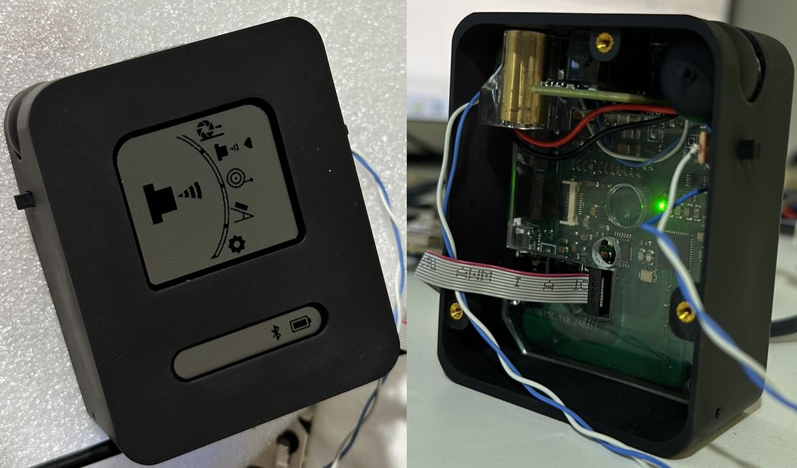

<!-- Project Header -->

  <h1 class="project-main-title">Cubit: Smart Measuring Instrument</h1>
  

  

    BLE
    Energy Harvesting
    ARM Cortex-M4
    Sensor Fusion
    Embedded Systems
    PCB Design
    CAD Design
    React Native
  

  

    &#8595; 
    <small>Scroll to explore</small>
  

  
  <!-- Project Image - Temporarily Hidden
  

    
  

  -->

  <nav class="project-nav">
    
📋 PROJECT SECTIONS

    <ul class="nav-list">
      <li><a href="#overview" class="nav-link" data-section="overview">🎯 Overview</a></li>
      <li><a href="#features" class="nav-link" data-section="features">⭐ Key Features</a></li>
      <li><a href="#architecture" class="nav-link" data-section="architecture">🏗️ System Architecture</a></li>
      <li><a href="#hardware" class="nav-link" data-section="hardware">🔧 Hardware Design</a></li>
      <li><a href="#firmware" class="nav-link" data-section="firmware">💻 Firmware</a></li>
      <li><a href="#challenges" class="nav-link" data-section="challenges">⚡ Engineering Challenges</a></li>
      <li><a href="#learnings" class="nav-link" data-section="learnings">📚 Learnings</a></li>
    </ul>
    

      <small>Click any section to jump there instantly</small>
    

  </nav>

  <main class="project-content">

## 🎯 Overview

> **Reimagining the measuring tape with low power and Bluetooth.**

This project builds a small instrument that measures **length, angle, and distance**, shows the value on a **Sharp Memory LCD**, and can send it over **BLE** when needed. The idea is simple: keep the familiar actions (roll a wheel, pull a string, point an ultrasonic sensor) but make the readings repeatable and easy to save.

Conventional tapes work, but the numbers usually end up on paper and vanish. This project tries to keep the workflow lightweight while adding just enough electronics to store, share, and reuse measurements—without burning through a battery.

<strong>🔍 The Problem We’re Solving</strong>

Most quick measurements are still manual and disposable. Data isn’t logged, there’s no history, and it’s hard to combine readings later. That’s fine for one-off tasks, but not great when accuracy and traceability matter.

This project turns those “one-time” numbers into usable data: capture on device, view on the LCD, and push over BLE when a record is needed. The goal is to keep the tool small and quiet on power so it actually gets used in the field.

<strong>💡 Our Solution</strong>

The device combines a **magnetic rotary encoder** (wheel and string modes), a **BNO055 IMU** (angles/orientation), and an **ultrasonic module** (longer ranges). An **EFR32BG13** handles the drivers, low-power states, and BLE. The **BQ25570** PMIC manages a **480 mAh Li-Po**, **solar input**, and a regulated rail around **3.2 V**. The UI is a **1.3″ Sharp Memory LCD** with four buttons for a simple menu.

Most of the time the system sits in **EM2**. Sensors power up only for the selected mode, report quickly, and drop back to sleep. That keeps average current low while still giving immediate feedback on the screen.

## Key Features

<strong>📏 Triple Measurement System</strong>

- **Wheel assembly** for flat/curved surfaces (size accuracy **±0.2 cm** as scoped).  
- **String–pulley** option for flexible materials and longer spans.  
- **IMU (BNO055)** for angle/orientation (target **±1°** in this setup).  
- **Ultrasonic sensor** verified **6–254 in** on bench.

<strong>🔋 Self-Sustaining Power</strong>

- **Solar harvesting** through **BQ25570** (MPPT + cold start).  
- **USB** input available for faster charging and bring-up.  
- **480 mAh Li-Po**, regulated system rail ~**3.2 V**.

<strong>📱 Wireless Integration</strong>

- **BLE** characteristics for linear, angular, and distance values.  
- Open-area link around **100 m** using the on-board antenna in tests.

<strong>🖥️ User Experience</strong>

- **1.3″ Sharp Memory LCD** (very low current) with clear menu pages.  
- **Four navigation buttons**; live readout while moving the wheel/string.

## System Architecture

<strong>🔧 Hardware Layer</strong>

- **MCU/Radio:** EFR32BG13 (ARM Cortex-M4 + BLE).  
- **PMIC:** BQ25570 energy harvester/charger with buck output to system rail.  
- **Linear:** AS5147P magnetic encoder (SPI; ABI used during early tests).  
- **Angular:** BNO055 IMU (I²C; on-chip fusion).  
- **Range:** UART ultrasonic module.  
- **Display:** 1.3″ Sharp Memory LCD.  
- **Energy:** Monocrystalline panel (measured ~**1.15 V** at the test board) + **480 mAh** Li-Po.

<strong>💻 Firmware Layer</strong>

- Event-driven state machine (Idle → Measure → Report → Sleep).  
- Drivers for **SPI** (encoder/LCD), **I²C** (IMU), **UART** (ultrasonic).  
- BLE GATT with separate characteristics per measurement type.  
- Power policy prefers **EM2**; sensors behind load switches.

## Hardware Design

<strong>⚡ Power Management System</strong>

This project uses **BQ25570** to harvest from solar and charge a **480 mAh** Li-Po, then regulates a stable system rail near **3.2 V** for the MCU, sensors, and LCD. A **220 µF** MLCC (Murata GRM32ER60J227ME05L) sits at the bulk node; under **DC bias** at ~3.2 V its effective value is about **100 µF**, which was enough to keep the rail steady during radio bursts and LCD updates.

**Notes from bring-up:**
- **Cold start** off harvester was required for first power-up if the battery was empty.  
- The regulated rail simplified brown-out behavior across sensors with different input limits.  
- Measured panel output around **1.15 V** on the prototype board matched the harvester path.

<strong>🎯 Sensor Integration</strong>

- **AS5147P** provided pulses for linear distance. A divide-by-8 counter was tried to lower the pulse rate but it **broke direction** (phase lost). Final choice was to **configure the encoder to 256 PPR** and handle counts in firmware.  
- **BNO055** ran on I²C for angles. Early **NACK** events were fixed with short retries and checking mode bits after power-cycle.  
- **Ultrasonic** data landed over UART. Changing RX off the VCOM pin avoided port contention during logging.  
- **Placement:** the encoder’s magnet was kept away from the IMU’s magnetometer, and the RF section stayed clear of the magnetic assembly.  
- **ESD:** **SP1003** on USB/battery and **SP1001-04** on the button cluster kept leakage low in sleep.  
- **Test points** on I²C, SPI, and ABI lines made logic-analyzer work straightforward.

## 💾 Firmware Implementation

<strong>⚡ Power Management</strong>

The firmware leans on **EM2** whenever possible. Sensors and the LCD sit behind load switches and only power up for an active mode. Core clock pulls down toward the LF domain when the UI is idle, then returns to HF for sampling or BLE activity.

<strong>📊 Sensor Management</strong>

- **Encoder:** configurable PPR; simple debounce and timestamping to avoid missed steps.  
- **IMU:** Euler angle readout with recovery from occasional NACKs after mode changes.  
- **Ultrasonic:** framed parse with sanity checks so serial debug doesn’t corrupt packets.  
- **LCD:** small page buffers for menu vs. live readout; quick partial refreshes.

<strong>📡 Communication Stack</strong>

A compact GATT exposes length, angle, and range. Advertising starts on boot; on connection the device sends indications on change or at a slow heartbeat to keep radio duty cycle down.

## Engineering Challenges

<strong>Clock Parts & Low Power</strong>

An early board used an LF **oscillator** footprint instead of a **32.768 kHz crystal**, which blocked proper low-power modes. Swapping to the crystal fixed EM2 behavior and the sleep current.

<strong>Direction vs. Divider</strong>

A hardware frequency divider reduced ABI pulse rate but **lost the A/B phase**, so direction couldn’t be trusted. Moving to **256 PPR** via encoder config kept counts manageable and preserved direction in firmware.

<strong>Magnet & RF Spacing</strong>

The encoder magnet disturbed the IMU’s magnetometer when placed too close. Spacing the parts and orienting the magnet path away from the IMU resolved it without shields.

<strong>Rail Dips on Activity</strong>

Radio activity plus LCD updates caused small dips on VSTOR. Accounting for **MLCC DC-bias** and sizing bulk to about **100 µF effective** stabilized the rail.

## Learnings

This project showed how easy it is for peripherals to sip power through I/O even when “off”—load switches should be part of the plan from the first schematic. Footprint choices matter more than they seem (a crystal vs. oscillator mistake cost real time and current), and **test points** on I²C/SPI/ABI paid back every minute spent placing them.

On the layout side, **DC-bias** derates big MLCCs a lot; picking by effective capacitance at the actual rail voltage is safer than reading the label. Keeping magnets away from RF and sensors solved interference more cleanly than filters. Finally, a small, event-driven state machine (Idle → Measure → Report → Sleep) was enough to keep the UI responsive while staying in **EM2** most of the time.

  </main>

